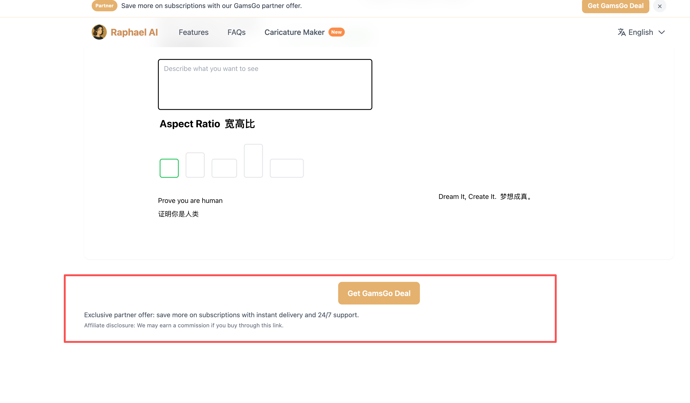
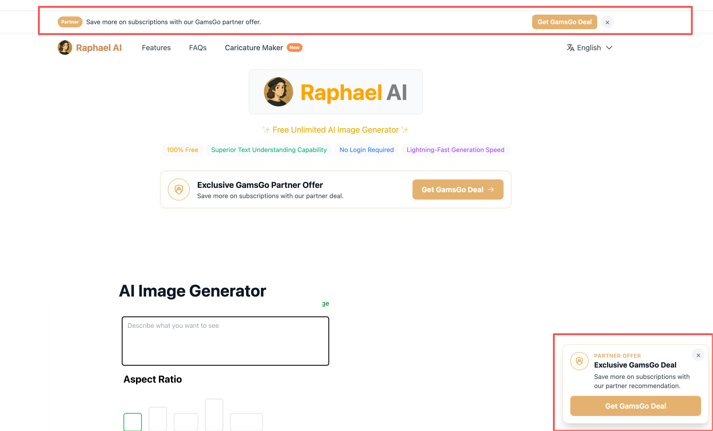

# 任务1
https://www.caricaturemaker.art/这个是新开发的我的网站。 我想在当前网站添加跳转到新网站，应该在哪里添加，给出设计方案和交互逻辑

回复使用中文呀

先给出方案呀后得到我的反馈

给出修改后的ASCII设计图呀

我如果想在导航栏添加，顶部公告栏这个有点不太好。你感觉如何。请客观的评价我的想法

好的，实现需要和网站的风格保持一致

先只改英文的，其它语言不要改

修改测试下呀，鼠标的hover效果需要和其他导航栏的Features、FAQs按钮一样呀一样呀，

给出转化率高的方案，网页中的内容都是英文呀
风格需要和首页的风格一致呀

# 任务2

加载/Users/a1-6/Desktop/code/skills-hub这个skill  

# 任务3
发现导航栏引流的效果不明显，应该咋办？是不是提示框会好些？

# 任务4
- 我要在当前项目中添加联盟营销，我的专属链接是：https://www.gamsgo.com/partner/mAQw8。这个是相关的文档https://www.gamsgo.com/zh/affiliate/overview。请规划下该如何展示这个。需要考虑到我当前已经有https://www.caricaturemaker.art/该网站的推广。需要总体收入最大
- 先给方案后等待我的反馈
- 使用中文回复
- 给出asicc设计图和交互逻辑呀

# 任务5
- 目前主推gamsgo，
- 先给方案后等待我的反馈
- 使用中文回复

# 任务6
- 去掉右下角弹框cta，请给出方案后等待我的反馈

# 任务7
移除红框中的内容

# 任务8
- 将上面红框中的弹框提醒改为随页面的移动而移动，去掉下面的弹框提醒
- 修改完成后测试下

# 任务9
- 移除掉页面所有GamsGo的内容
- 先给出方案后再等我的反馈

# 任务10
- 目前是vercel上部署https://vercel.com/zcerhubs-projects/raphaelai-v1这个项目里面，目前使用的是哪个首页呀，是app里面的换是index。html文件，将没有用的首页给去掉
- 先给出方案后再等我的反馈